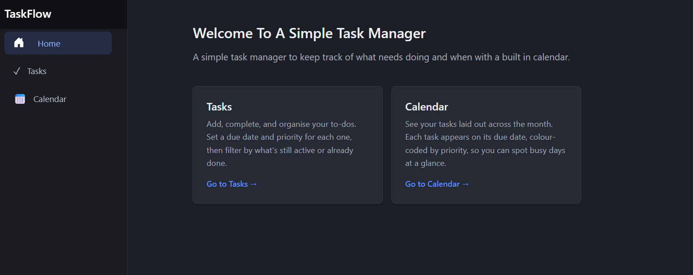
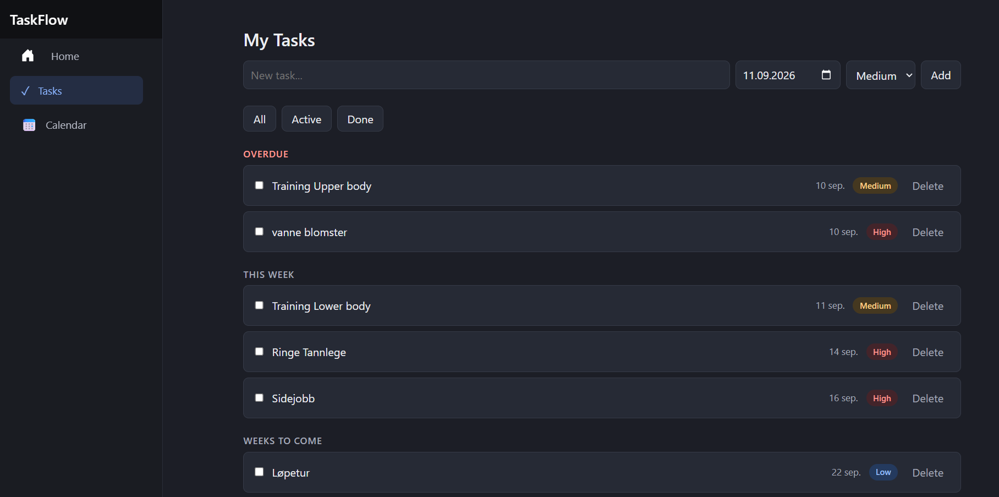
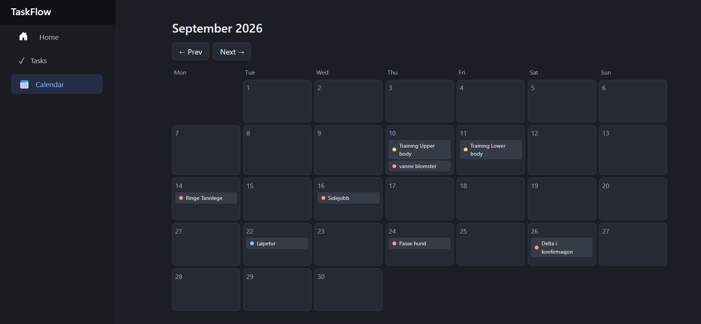

# TaskFlow

A simple task management app with a monthly calendar view, built with **Blazor Server**, **Entity Framework Core**, and **SQLite**.

Tasks can be created with a due date and priority, marked complete, filtered, and grouped by urgency — and every task automatically appears on its due date in a colour-coded calendar.



---

## Features

- **Create tasks** with a title, due date, and priority (Low / Medium / High)
- **Complete and delete** tasks with a single click
- **Filter** tasks by All / Active / Done
- **Grouped view** — tasks are sorted under *Overdue*, *This week*, and *Weeks to come*
- **Monthly calendar** — tasks appear on their due date, colour-coded by priority
- **Past-date validation** — you can't set a due date in the past
- **Dark theme** throughout

---

## Screenshots

### Tasks page
Add tasks, set priority and due date, and see them grouped by urgency with colour-coded priority pills.



### Calendar page
Each task lands on its due date, with a small coloured dot indicating its priority. Navigate between months with the Prev / Next buttons.



---

## Tech stack

| Layer | Technology |
|---|---|
| Language | C# |
| Framework | .NET 10 / Blazor Server |
| UI | Razor components |
| Data access | Entity Framework Core |
| Database | SQLite |

---

## How it works

The app is organised into clear layers:

- **`Models/`** — the `TaskItem` model that defines what a task is.
- **`Data/`** — the `AppDbContext`, the Entity Framework Core bridge between the C# models and the database.
- **`Services/`** — the `TaskService`, which holds all the logic for reading and writing tasks. The UI never touches the database directly; it goes through this service.
- **`Components/Pages/`** — the Blazor pages (`Tasks`, `Calendar`, `Home`) that make up the interface.

Because it uses **Blazor Server**, the entire app, front end and back end is written in C#, with no separate JavaScript API layer. A button click in the UI calls a C# method on the server, which reads or writes the database and updates the page.

---

## Running it locally

You'll need the [.NET 10 SDK](https://dotnet.microsoft.com/download) installed.

```bash
# Clone the repository
git clone https://github.com/martinkarlsen01/Task-Managment-in-C-sharp.git
cd Task-Managment-in-C-sharp/TaskFlow

# Run the app
dotnet run
```

Then open the URL shown in the terminal (usually `https://localhost:5001`) in your browser.

The SQLite database is created automatically on first run, the app applies its migrations on startup, so there's no manual database setup.

---


## Possible next steps

- User accounts, so multiple people can keep separate task lists
- Recurring tasks
